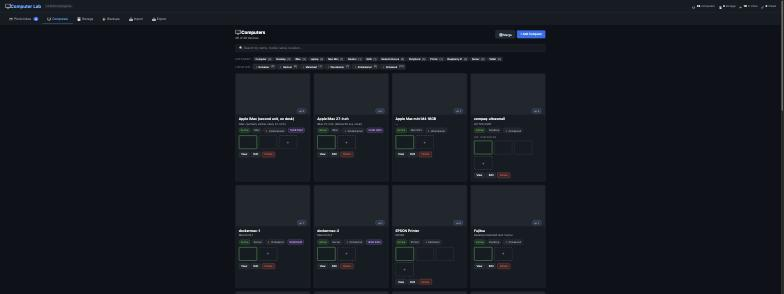
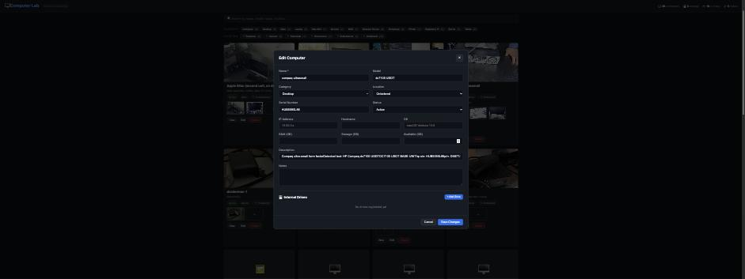
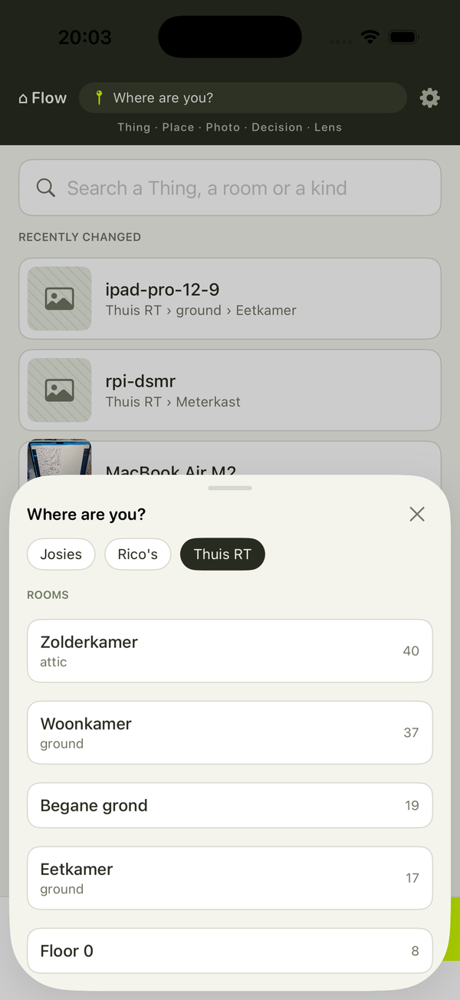
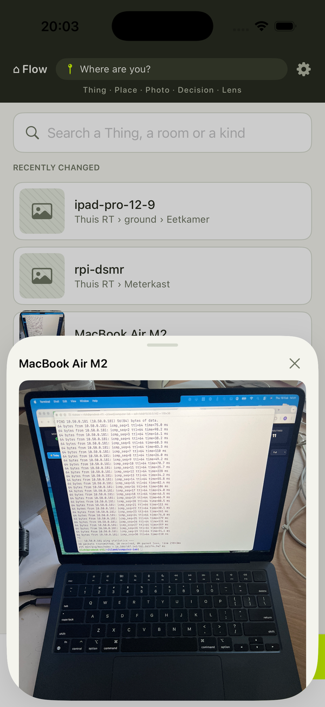
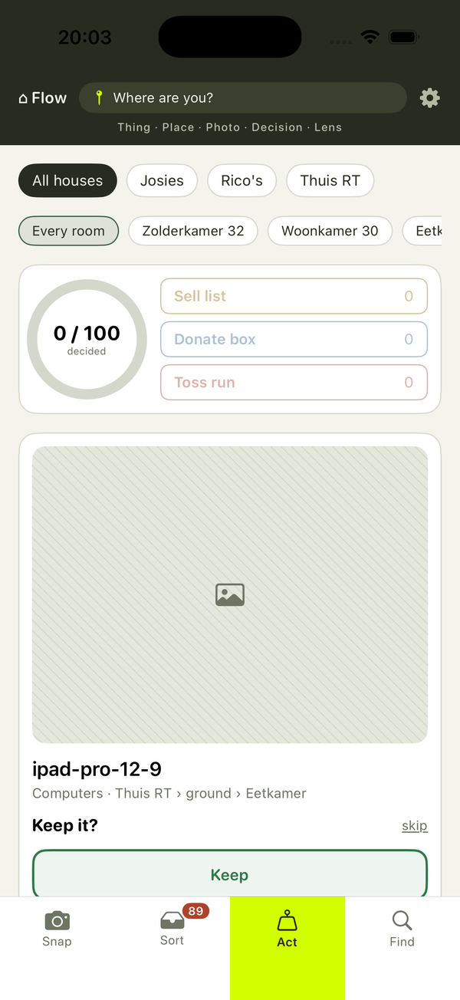

# HomeBase status, 2026-10-03

> Follow-up to the architecture review of 2026-10-02 (claude.ai artifact EA2FJfZuLd8Daco9NwZjxF). Where this page is served is Rick's decision; the file is self-contained.

## In one paragraph
HomeBase now has one data model: a Thing is located by `roomId` (house and floor live on the room), pictures live in `photos`, `item_links` and `photo_pins`, and captures are the inbox queue. The open ends left by the rooms and photos consolidations are closed, except for the deferred list under Open items. Flow is its own front end (`/flow/`) on the same API, with its own contract list in `AGENTS.md`. The Computer Lab adapter runs on the live API (:3476, house 2) and passed an 11-check read-only smoke plus an 8-line browser checklist on the old UI; its data was migrated through `attachments.add`. The iOS app builds with zero compile errors (baseline: 6) and is on main (`ios/`); its read-only simulator run against production (Find, Thing sheet, Act, Sort) passed; the write run against the test database (W1–W7) needs taps in the Simulator and is still open. Nothing is pushed yet: main is 41 commits ahead of origin/main, and the final build was deployed to :3001 on 2026-10-03 at 17:59 UTC (restart run by Rick).

## What changed since the review
| Phase | State | Commits (main) |
|---|---|---|
| 0 Hygiene | done | `2fb4abd` |
| 1 Safety (app token, uploads, transactions) | done | `d24d129` |
| Test-DB seam | done | `c1e5343` |
| 3a One rooms concept | done, live since 2026-10-02 | `57fc04c`, `3121f86`, `2e490d2`, `3711cf4`, `fa4aa8e`, `6dbc768`, `8d3db0e`, `87a2921`, `973f256`, `3578fd0`, `630cf9e`, `24c119c`, `85a3b03`, `a4f32c9`, `41dfe60`, `5b29f5e`, `904753d`, `0435ea1`, `5ed23bd`, `e85167d` |
| 3b One photos table | done, live; migration 0006 applied | `368222c`, `b1239da`, `5a9d47d`, `6246fdd`, `f1b2d82`, `d7a28ae`, `ff74b18`, `7fdc8c6`, `a283610`, `bed299c` |
| Finalize (this plan) | done, deployed 2026-10-03 17:59 UTC | Server open ends `c114c0e`, Workbench and Flow open ends `7d63cac`, Flow as its own front end `7088f91`, lab drives `6a0d702`; iOS (on main) `45f7877`, `a736b37`, `22c56ad`, `86ba98d`, `c350867` |
| 2 AI module and evaluation | not started | - |
| 4 Views | not started | - |

## Data model
| Table | Holds |
|---|---|
| `areas` | The fields of work (areas) that group items and topics. |
| `houses` | The houses; the session house comes from the `x-house-id` header. |
| `rooms` | Rooms per house with floor, plan geometry and parent room; the only place location lives. |
| `items` | Things: attributes, status, decision, verification status, parent, `roomId`. |
| `photos` | Images, with optional `itemId` / `roomId` / `areaId`; cutouts point at `sourceCaptureId`. |
| `item_links` | A link, a note or a non-image file on an item. |
| `photo_pins` | Pins on a photo, each pointing at an item or an open suggestion. |
| `captures` | The inbox queue: raw captures waiting to be sorted. |
| `measurements` | Measured sizes of a room or item (laser, tape or scan). |
| `relations` | Item to item relations (`related-to`, `backs-up`, ...), user or AI made. |
| `ideas` | The idea board entries. |
| `idea_items` | Which items an idea concerns. |
| `tasks` | Kanban tasks. |
| `time_logs` | Time spent per task. |
| `wiki_pages` | Generated markdown pages per area, item and index. |
| `events` | Append-only audit log of everything that happens. |
| `chat_messages` | Ask-mode conversations, global or scoped to an area or item. |

Location: `items.roomId` points at `rooms`; house and floor live on the room. `x-house-id` is the session house; without it, lists cover all houses.

Pictures: `photos` holds images (optional `itemId` / `roomId`; cutouts point at `sourceCaptureId`), `item_links` holds link, note and file entries, `photo_pins` holds the pins on a photo. `captures` is the inbox queue.

Migrations:
- `0000_baseline.sql`: the baseline schema.
- `0001_events_entity_index.sql`: index on events by entity and time.
- `0002_item_decision.sql`: `items.decision` and `items.decidedAt`.
- `0003_rooms_floor.sql`: `rooms.floor` and a unique room name per house.
- `0004_drop_location_strings.sql`: drops `items.floor/room`, `attachments.houseId/floor/room` and `houses.floors`.
- `0005_add_photos_tables.sql`: adds `photos`, `item_links` and `photo_pins`.
- `0006_drop_attachments.sql`: drops `attachments` and `photo_annotations`.

## Clients and their contracts
| Client | Where | Calls |
|---|---|---|
| Workbench | `/` | full API |
| Flow | `/flow/` | `ping`, `inbox.list`, `inbox.create`, `inbox.triage`, `inbox.acceptMany`, `inbox.dismiss`, `items.listAll`, `items.get`, `items.create` (`roomId`, `houseId`), `items.update`, `items.setVerification`, `items.setArchived`, `items.setDecision`, `items.patchAttributes`, `items.addRelation`, `items.removeRelation`, `items.listRelations`, `houses.list`, `areas.list`, `rooms.list`, `rooms.ensure`, `attachments.url` (deprecated alias of `photos.url`), `rooms.get`; photos: `photos.url`, `photos.get`, `photos.listAll`, `photos.listForItem`, `photos.add`, `photos.remove`, `photos.unlink`, `photos.ensureForCapture`, `photos.createCutout`, `photos.recrop`, `photos.forRoom`, `pins.*`, `itemLinks.add`, `itemLinks.remove`, `itemLinks.listForItem`; HTTP `POST /api/upload` |
| iOS app | `ios/` | `ping`, `inbox.list`, `inbox.create`, `inbox.triage`, `inbox.acceptMany` (`roomId`), `inbox.dismiss`, `items.listAll`, `items.update` (`roomId`), `items.setVerification`, `items.setArchived`, `items.setDecision`, `items.patchAttributes` (client ready, unused in V1 UI), `houses.list`, `areas.list`, `rooms.list`, `rooms.ensure`, `rooms.get`, `photos.url`; HTTP `POST /api/upload`; header `x-house-id` from Settings |
| Computer Lab adapter | `/Volumes/T7/computer-lab-ssot`, :3476 | `items.listAll` (`houseId: null`), `items.get`, `items.create`, `items.update`, `items.setArchived`, `items.setDecision`, `items.setParent`, `items.addRelation`, `items.removeRelation`, `items.patchAttributes`, `items.listRelations`, `rooms.list` (`houseId: null`), `rooms.ensure`, `photos.listAll` (falls back to `attachments.listAllImages`), `photos.add`, `photos.unlink`, `photos.listForItem`, `inbox.list`, `inbox.create`, `inbox.triage`, `inbox.acceptMany`, `inbox.dismiss`, `areas.list`, `houses.list`, `ping`; HTTP `POST /api/upload`, `GET /uploads/:name`; header `x-house-id` when `HOMEBASE_HOUSE_ID` is set |
| Home Inventory Twin view | lidarventory, :8001, read-only | `items.listAll`, `rooms.list`, `rooms.get`, `photos.listAll`, `photos.forRoom`, `pins.listForItem` |

Deprecated, kept for one release: `attachments.url/add/remove/unlink/listAllImages/listForItem`.

## How it was validated
- Server: Test Files 17 passed (17), Tests 109 passed (109) on `declutter_test`; `npm run check`, eslint at or below the baseline (33 problems, 28 errors, 5 warnings), `npm run build`.
- Production deploy: before smoke `{"ping":true,"houses":3,"rooms":11,"roomsHaveDims":false,"items":173,"itemsWithImage":99,"catalog":179,"catalogHasTitle":false,"legacyCatalog":179,"workbenchTitle":"HomeBase Inventory","flowTitle":"HomeBase Flow"}`; after smoke `{"ping":true,"houses":3,"rooms":11,"roomsHaveDims":true,"items":173,"itemsWithImage":99,"catalog":179,"catalogHasTitle":true,"legacyCatalog":179,"workbenchTitle":"HomeBase Inventory","flowTitle":"HomeBase Flow"}` (same counts; `roomsHaveDims` and `catalogHasTitle` now true). Backup before the deploy: `~/declutter-before-finalize-20261003-1948.sql`.
- Workbench and Flow click-throughs on the test database: Workbench (Task 3) all 10 lines passed; Flow (Task 4) all 11 lines passed, with one fix: the Find sheet of an internal drive showed the backup picker; it now reads "Backed up (with its computer) · <computer>".
- Computer Lab: PASS status-reachable, computers-match (26 via adapter, 26 via `items.listAll({houseId:null})` across 2 houses), computer-locations (26), computer-photo-counts (118 filed photos), photo-captions (8 titled photos on computers, re-run after the deploy), drives-match, storage-match (3 storage devices), backups-match (0), locations-cover-rooms (11 rooms, 16 locations), stats-consistent, inbox-match (16 lab inbox photos): all 11 checks passed. Browser checklist on the old UI: all 8 lines passed.
  
  
- iOS: built with Xcode 26.6 (baseline 6 compile errors in `ActView.swift`, now 0; one fix: `self.error` in catch blocks), run on the iPhone 17 Pro simulator; read-only against production over the Mac's loopback: R1 Find (house labels, thumbnails), R2 Thing sheet (name, photo), R3 Act (counts, named room chips, a card), R4 Sort (filter counts, first card), R5 header pill "Where are you?" all passed. The brief's default address 10.50.0.10:3001 was the database host; corrected to 10.50.0.102:3001. Writes against the test database (W1–W7) need taps in the Simulator and are not run yet, so Review Focus 4 (a new Thing filed with `itemId: null`) is verified only by the encoder test in review, not end to end.
  
  
  

## Computer Lab migration
- Before this check: `{"internalDrivesWithLabRef":14,"photosTitledLabPhoto":19,"itemsWithLabRef":42}`.
- Dry run: blocked: the old lab app at :3475 was not running (a rerun dry run by the declutter-flow session reported 0 to do).
- Apply: applied on 2026-10-03 by the declutter-flow session through attachments.add (1 item Fujitsu #218, 14 internal drives, 19 photos titled lab-photo:<id>, 3 drive_type updates, 16 inbox captures); a rerun dry run reported 0 to do.

## Open items
Deferred in the server sweep (Task 2):

| item | why it waits |
|---|---|
| rooms router: un-cut `remove` writes `items.roomId` outside the transaction; grandchildren not re-parented; `remove` counts all statuses while `list` counts active; `update` with no fields gives a 500; merge reads outside the transaction and the target does not inherit `parentRoomId`/offsets/`lat`/`lng`; `ensureRoom` floor backfill logs no event; floor sort is alphabetical | Each touches cut rooms on scanned plans (a handful of rooms) and several need a product call (what a merged room inherits). No client sends an empty `rooms.update`. Candidate for the views phase (roadmap phase 4). |
| `cutFromRoom` lookup-to-transaction race with `ensureRoom`; `walls: []` counted as "has a plan" | Needs two people cutting the same plan at the same moment; no UI writes `walls: []`. |
| `resolveSuggestion` fallback `roomId` without label; no direct test of the `fileObject` transaction or `houses.remove` | Cosmetic (the picker shows the room by id); covered indirectly by `photos-cutover` and `houses` tests. |
| `readSourceBytes` maps every error to "no longer available"; `createCutout` reads the source before the dedupe; `remove`/`unlink` on a missing row still log; `itemLinks.add` kind `file` without `storageKey`; `pins.add` does not check the photo exists; `att` variable name in `pins.ts`; small duplications | Log noise and naming; no data loss. |
| Image-capture `rawText` not stored on the filed photo | Product decision for "P2" (captures into photos), already out of scope in the photos plan. |
| Copy script (`copy-attachments-to-photos`) verification limits; backfill and rooms migration scripts without dry-run/transaction; cross-house sync and collation notes | One-shot scripts that already ran on production; they never run again. |
| Test hygiene: `areas.test` lacks the all-houses case; `callerFor` header-to-ctx wiring untested; `db.smoke` speed; nested `describe` indentation; a Focus-2 test asserting the message instead of the TRPCError code; one shared test DB across worktrees | No behaviour at risk. The shared test DB is handled by the rule "one `npm test` at a time" (this plan runs tests in one worktree only). |

Parked review items (Minor, deferred):
- Task 2: `ensureForCapture` can orphan a file on COMMIT failure (`withNewFile` sits inside the transaction there).
- Task 2: `sniffMime` with unknown bytes gives a 500.
- Task 2: `resetTestDb` releases a connection after a failed `SET FOREIGN_KEY_CHECKS = 1`.
- Task 2: "position updated" history noise on house-only moves.
- Task 2: the merge target's own items keep their old-frame `pos`.
- Task 2: the brief's Step 13 grep contradicts its Step 2b.
- Task 2: `fileObject` creates the item before the cutout transaction (pre-existing).
- Task 2 (Important, parked): the double-tap test "two calls at once make one photo" passed red in the whole-file run, so it is a weak regression guard for the `FOR UPDATE` lock.
- Task 3: Galaxy room bubbles lack the house name when "All houses" is on; seed reruns leave orphan `test-*.jpg` files (harmless).
- Task 4: IIFE style in `FindTab`.

Workbench and Flow items not done in Task 3: ItemDetail picker keyboard (Tab, Escape, blur), `setLastRoomId` timing, PinPending's extra `rooms.list`, entries sort tiebreak, wiki ordering, `attId` naming, the two `typeof roomList.data` eslint warnings, Flow header switcher style on a dark header, Flow `ensure` error not cleared on edit.

Product follow-ups: P2 (captures into photos), roadmap phases 2 and 4, removing the deprecated `attachments.*` aliases after the next release.

Git: main is 41 commits ahead of origin/main; `ssot-homebase` in the lab repository (`/Volumes/T7/computer-lab-ssot`, commit `85329f2`) is unpushed; `ios/rooms-contracts` is merged into main. Pushing is Rick's call.
